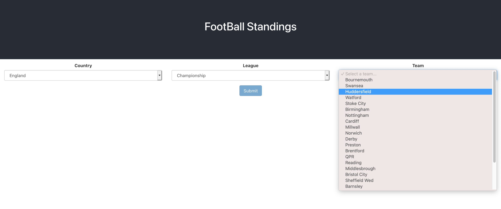
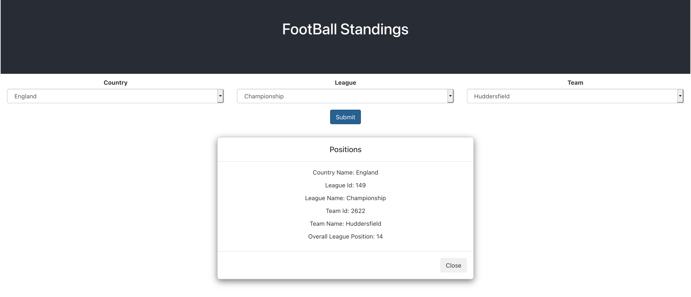

## Intro

This repository contains the backend spring boot app and the UI bundled together. The UI is made in ReactJS and is bundled using frontend maven plugin.
This app runs on `localhost:8080`

## Prerequisite

- Java 8
- Docker

## Installation steps

### build the combined jar
- `mvn clean install`

### run
- `java -jar target/football-standings.jar`
- `localhost:8080`

### docker build

- `docker build -t <tag> .`

## Pipelines
- Jenkins is configured. Pipeline details can be found in `JenkinsFile`

## Some snapshots
Choosing countries > leagues > team

Getting the standings

